title: "Week 2 of Neural Networks and Deep Learning"
description: "Imported from Ghost using platos-ghost."
layout: post
tags: plato-long nn coursera deeplearning
category: blog
---

# Neural Network Basics 

These are my notes on week #2 of the [Introduction to Deep Learning](https://www.coursera.org/learn/neural-networks-deep-learning/) Coursera MOOC.

## Binary Classification

[Video #1](https://www.coursera.org/learn/neural-networks-deep-learning/lecture/Z8j0R/binary-classification) basically sets up some notation for showing how a matrix input maps to one bit of information (1 or 0, true or false, i.e. whether a picture is of a hotdog [or not](http://www.foodandwine.com/news/silicon-valleys-hot-dog-identifying-app-very-real)).

## Logistic regression

[Video #2](https://www.coursera.org/learn/neural-networks-deep-learning/lecture/LoKih/logistic-regression) shows how Logistic Regression trumps Linear Regression in the sense that the latter will output values in the range negative to very large (>1), which is not what we want for binary classification. Instead, Logistic regression "clamps" the output to **0 <= y^ <= 1** using a sigmoid function. "y hat", i.e. *y^* will be the prediction of *y*, the "ground truth".

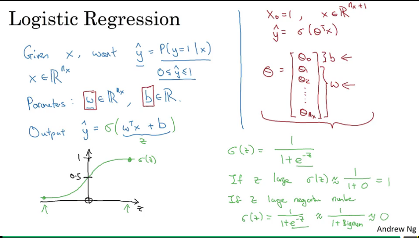


## Logistic regression cost function

[Video #3](https://www.coursera.org/learn/neural-networks-deep-learning/lecture/yWaRd/logistic-regression-cost-function) explains the cost function needed to train parameters *w* and *b*.
Square error doesn't work well as a loss (or error) function, because no global minimum can be obtained. It makes gradient descent not work well at all (your "ball" gets trapped in the first "hole" as it rolls down the hill). We want a function which ends us up with one convex basin, not a squiggly line (many basins).

The cost function measures how well you're doing over the entire training set. 

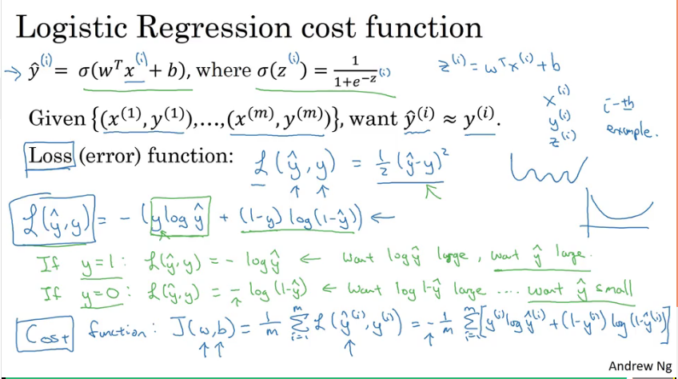

## Gradient descent

[Video #4](https://www.coursera.org/learn/neural-networks-deep-learning/lecture/A0tBd/gradient-descent) discusses gradient descent as an "optimisation algorithm" shows how logistic regression can be used as a tiny neural net.

Gradient descent is your "ball rolling to the bottom of the basin", or final a local optimum for *w*. It shows how taking the derivative (or the slope) of the curve finds the optimum where the slope is 0 (a flat line underneath the curve). For the multi-dimensional case where we're finding *w* AND *b*, it would be the plane under the basin.

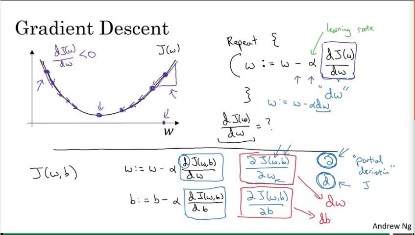


The latter part of the video makes a brief note of calculus where you can use *d* for the derivative of a single-variable function, or *squiggly-d* as the partial derivative of a multi-variable function, or the cost function, in our case: *J(w,b)*

## Derivatives

[Video #5](https://www.coursera.org/learn/neural-networks-deep-learning/lecture/0ULGt/derivatives) is just a calculus refresher.

Ditto for [Video #6](https://www.coursera.org/learn/neural-networks-deep-learning/lecture/oEcPT/more-derivative-examples).

If you are in need of a calculus refresher, I suggest supplementing these two videos with [3blue1brown's channel](https://www.youtube.com/channel/UCYO_jab_esuFRV4b17AJtAw) or [Khan Academy](https://www.khanacademy.org/) and also pay attention to the "chain rule".

During this course, you're not expected to derive the derivatives - all the ones you need are provided, or otherwise consult the derivative lookup tables in any calculus textbook.

## Computation graph

[Video #6](https://www.coursera.org/learn/neural-networks-deep-learning/lecture/4WdOY/computation-graph) talks about the computation graph which explains why neural networks are organised in terms of a forward pass (for the output of the network) and a back propagation step (for the gradients or derivatives). It shows an example of working through a computation graph to compute the function J (the cost function).

[Video #7](https://www.coursera.org/learn/neural-networks-deep-learning/lecture/0VSHe/derivatives-with-a-computation-graph) goes further with more examples, like computing the derivate of *J* with respect to *v*, or *J* with respect to *a* in this graph:

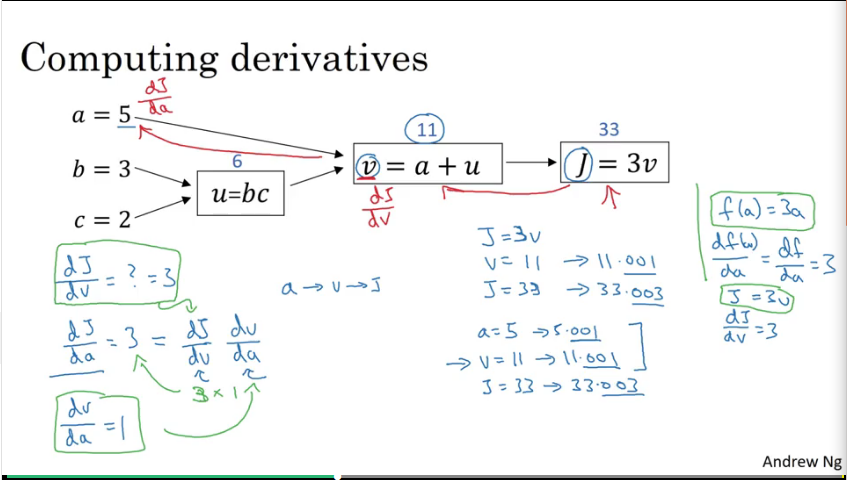

If *v* or *a* nudges by a little bit (0.001), then *J* nudges by 3 times as much.

Ng further shows that nudging *b* by 0.001 nudges *J* by 6 times as much, and *c* 9 times as much.

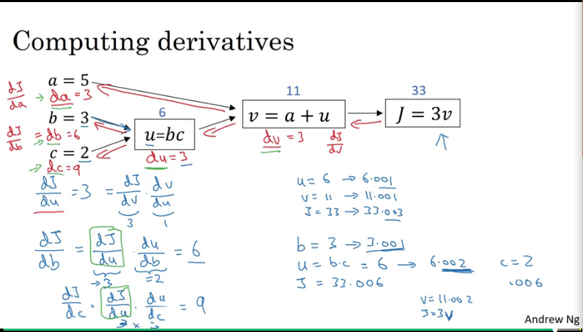

I like how this video uses a decimal (0.001) change to show how *J*'s decimal changes, and all-in-all building up good "number sense" for derivatives and forward- and back-propagation.

Also, in Python code, the variable representing "the derivative in terms of VAR" would just be written in code as *dvar*, e.g. *da*.

## Logistic regression gradient descent

[Video #8](https://www.coursera.org/learn/neural-networks-deep-learning/lecture/5sdh6/logistic-regression-gradient-descent) discusses the key equations needed to compute gradient descent for logistic regression. Ng uses the computation graph to illustrate again.

Recap logistic regression:

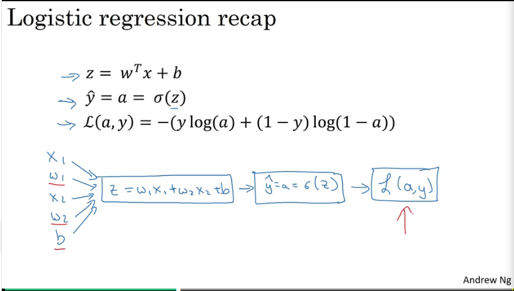

The example using the computation graph shows how to get the derivatives of the weights and the learning rate, with which to update the weights and learning rate:

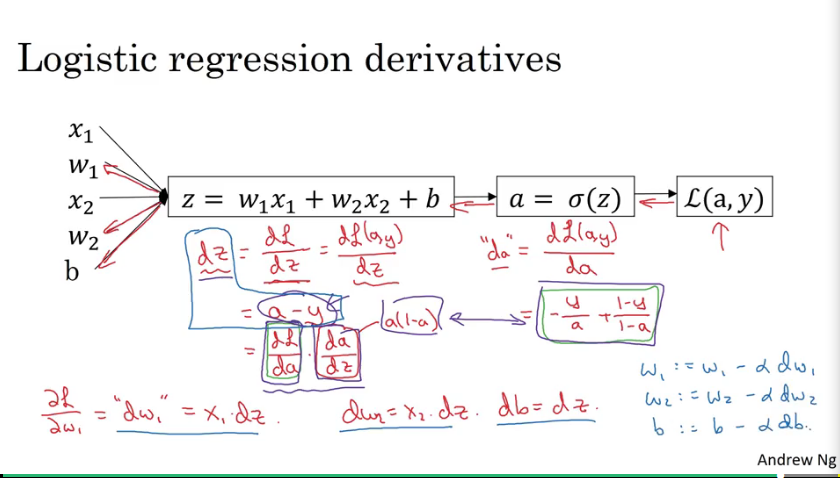

## Gradient descent on m examples

[Video #9](https://www.coursera.org/learn/neural-networks-deep-learning/lecture/udiAq/gradient-descent-on-m-examples) takes the previous single example and applies it to a training set of *m* examples. (reminder that the cost function *J* is the loss function *L* over *m* examples.)

Ng scribbles down some pseudo-code (for two features: *dw1* and *dw2*) and makes a note about using for loops with large data sets, and how the expensiveness of it can be circumvented by vectorisation, which is discussed in the next video.

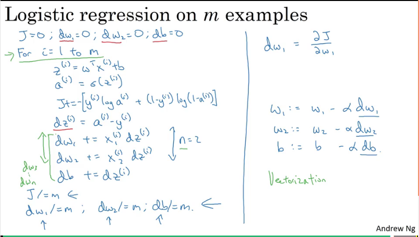

## Vectorisation

[Video #10](https://www.coursera.org/learn/neural-networks-deep-learning/lecture/NYnog/vectorization) starts with "vectorisation is the art of getting rid of for loops in code".

A quick Jupyter example shows the speed-up:

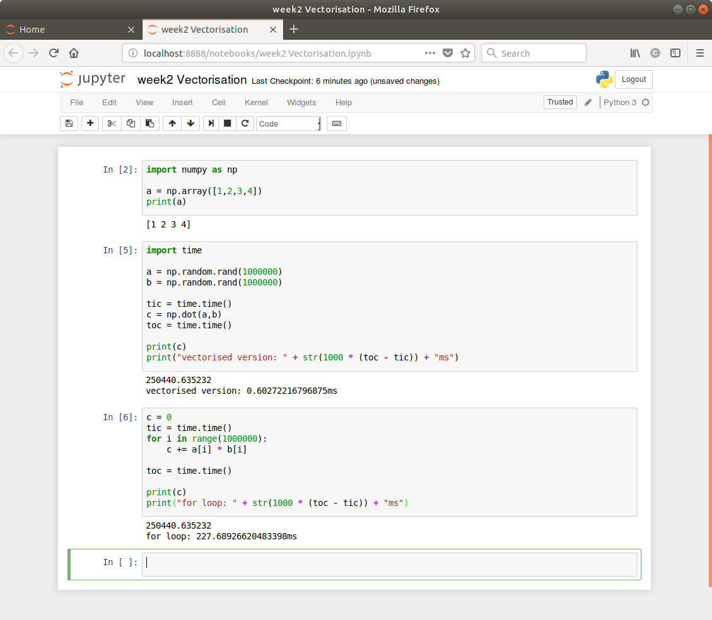

[Video #11](https://www.coursera.org/learn/neural-networks-deep-learning/lecture/ZPlX9/more-vectorization-examples) elaborates with more Python examples. Numpy will have element-wise functions for each of *exp*, *log*, *abs*, etc so you'll never need to loop.

[Video #12](https://www.coursera.org/learn/neural-networks-deep-learning/lecture/moUlO/vectorizing-logistic-regression) talks about vectorising logistic regression.

Just a note: Activation = forward propagation = predictions, terms Ng uses interchangeably. *a* is also denoted *y^* (y hat being the prediction) sometimes.

"1 by m" matrix is just a "row vector", or "an m-dimensional row vector".

Here he shows how you can get *z1*, *z2*, ..., *zm* for m samples, where *z1 = w.transpose \* x1 + b* using just

```
Z = np.dot(w.T, x) + b
```

And doing the same for *A* using some implementation of sigma.

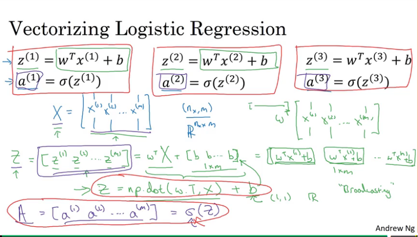

# Vectorising logistic regression's gradient computation

[Video #13](https://www.coursera.org/learn/neural-networks-deep-learning/lecture/IgFnJ/vectorizing-logistic-regressions-gradient-output) explains logistic regression for m samples using numpy.

It has `Z = np.dot(w.T, x) + b` from before, but adds 


```
A = sigmoid(Z)
dZ = A - Y
dw = 1/m * X * dZ.T
db = 1/m * np.sum(dZ)
w := w - sigmoid(dw)
b := b - sigmoid(db)
```

Then he wraps it with a `range(1000)` outer loop, and I guess it will become more apparent later that these extra iterations gets your weights to a value where they "settle" (and you can probably break out of the loop if the delta becomes neglible).

## Broadcasting in Python

[Video #14](https://www.coursera.org/learn/neural-networks-deep-learning/lecture/uBuTv/broadcasting-in-python) basically means when using Python/numpy, when working with arrays and matrices, the code will intuitively do the right thing.

E.g. here you want to add 100 to the 4x1 column vector, but numpy will "broadcast" 100 into a 4x1 vector of 100s.

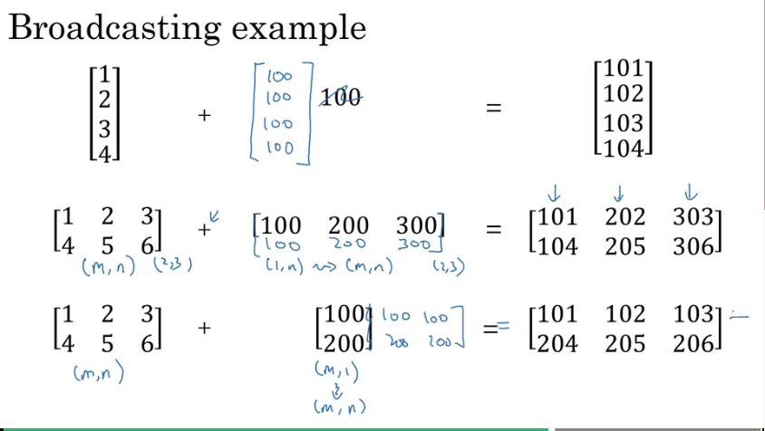

Ng refers to the [numpy docs on broadcasting](https://docs.scipy.org/doc/numpy/user/basics.broadcasting.html).

## A note on python/numpy vectors

[Video #15](https://www.coursera.org/learn/neural-networks-deep-learning/lecture/87MUx/a-note-on-python-numpy-vectors) talks about the pitfalls of working with rank-1 arrays, and urges you to be explicit about your matrix dimensions.

## Quick tour of Jupyter

[Video #16](https://www.coursera.org/learn/neural-networks-deep-learning/lecture/ChN1T/quick-tour-of-jupyter-ipython-notebooks) introduces us to Jupyter (previously known as iPython notebooks).

## Explanation of logistic regression cost function (optional)

[Video #17](https://www.coursera.org/learn/neural-networks-deep-learning/lecture/SmIbQ/explanation-of-logistic-regression-cost-function-optional) quickly explains why we like to use the cost function that we do for the logistic regression. Ng recaps the formulas for binary classification, and gets to using "maximum likelihood estimation" from statistics to derive our cost function.

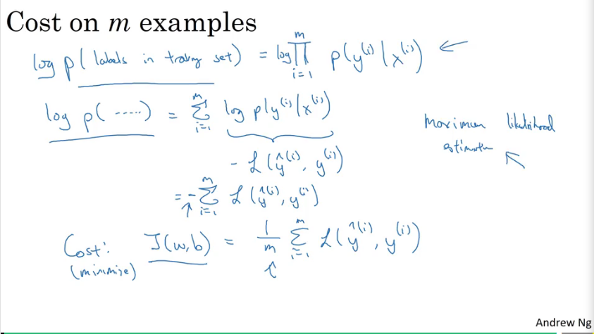

And that's a wrap for week 2.

## Code snippets

Here follows some code snippets I picked up along the way.

https://gist.github.com/opyate/e28992cbaacf6623fa04b0455d72d25d

## What else I've learned


### Clean and pre-process

Before building a neural net, you'll need to pre-process your data. (This is the same gist I picked up when doing my NN diploma back in 2001: cleaning and preparing data is sometimes the hardest part)

Common steps for pre-processing a new dataset are:

* Figure out the dimensions and shapes of the problem (m\_train, m\_test, num\_px, ...)
* Reshape the datasets such that each example is now a vector of size (num\_px * num\_px * 3, 1)
* "Standardize" the data, e.g. divide each pixel by 255


The oval "neuron" in this diagram computes a linearity (Wx + b) and then an activation (sigmoid, tanh, ReLU) which is the prediction.

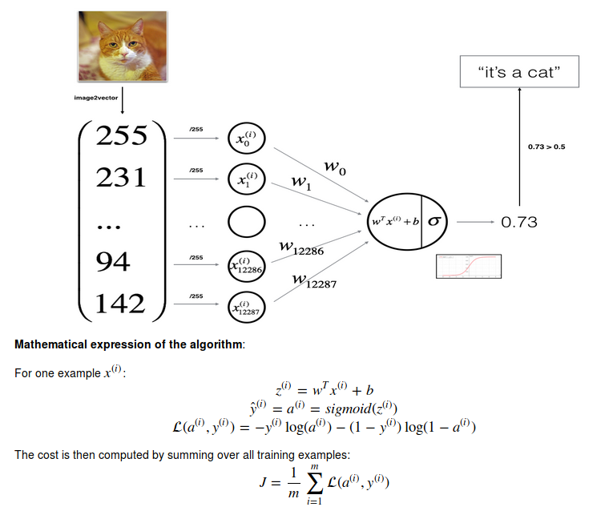

### Key steps to building a model

- define the model structure, such as number of input features
- initialize the parameters of the model, e.g. initialise the weights *w* to zeros or ones, or random numbers, and initialise the bias *b* 
- loop
    * forward propagation: calculate current loss; from *X* to *cost*
    * backward propagation: calculate current gradient
    * update parameters (weights and bias): this is gradient descent!

You have a choice of activations

- sigmoid
- tanh
- ReLU

You have a choice of loss functions:

- L1, or "least absolute deviations" (LAD), or "least absolute errors" (LAE)
- L2, or "least squares error" (LSE)
- L3? (as per week2) or "log-likelihood"?

Good activations and loss functions seem to be "stumbled upon" empirically, and must be a topic of research.

Picking good hyperparameters (number of iterations, and learning rate) is an art?
Different learning rates give different costs and thus different predictions results.

An example of good/bad learning rates are illustrated below: good rate converges, and a bad rate diverges. (Images: Adam Harley)


If the learning rate is too large, the cost may oscillate up and down, or diverge completely. 
Lower cost isn't necessarily better, and could lead to overfitting. It happens when the training accuracy is a lot higher than the test accuracy.

More techniques in later weeks to reduce overfitting.

We have just built a single-node neural network, and from the NN course I did in 2001 I remember this being called a [perceptron](https://en.wikipedia.org/wiki/Perceptron).

